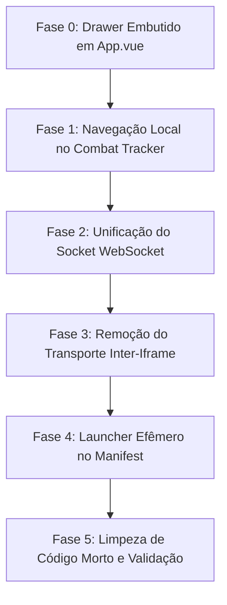

# Plano — Um Único Iframe (Fim do Conflito de Id/Versão e Consolidação Arquitetural)

> **Decisões de Design Consolidadas:**
> 1. O painel completo (**Chat + Combat Tracker + Marcadores de Tokens**) torna-se um **drawer / painel embutido na janela única** (o popover persistente da direita, onde rodam as fichas e os encontros).
> 2. A **segunda janela persistente é REMOVIDA**. O ícone na barra de ferramentas do Owlbear Rodeo passa a atuar como gatilho (launcher efêmero) para abrir, restaurar ou focar a janela única.
> 3. Todo o estado, ciclo de vida reativo e comunicação de rede passam a existir em **um único processo JavaScript**:
>    - **1 usuário = 1 processo JS = 1 conexão WebSocket = 1 escritor no IndexedDB = 1 iframe persistente**.
>    - Acabam os conflitos de dois sockets para o mesmo `playerId`, a trava de "somente-leitura", a corrida de versões LWW que descartava patches de dano, os combatentes duplicados no reload e o IPC frágil via `BroadcastChannel` / `postMessage`.

---

## 1. Diagnóstico Atualizado: Por Que os Conflitos Existiam

| Sintoma Observado | Causa Raiz Estrutural (Arquitetura Dual-Iframe) | Resolução com Iframe Único |
| :--- | :--- | :--- |
| **Patch de dano descartado** ou rejeitado no servidor | A janela de chat abria uma 2ª conexão WebSocket com o **mesmo `playerId`**. Como o servidor Go não faz eco para o remetente, a janela de chat ficava com a **versão defasada** da ficha, e o algoritmo LWW descartava patches legítimos. | **1 conexão por cliente**: toda mutação e patch partem da mesma instância com sequência de versão monotonicamente crescente. |
| **Recarregamento de combate encerrado** / combatente duplicado | Ambas as instâncias escutavam IndexedDB e tinham timers de salvamento concorrentes (`SaveController` com throttling). Uma janela salvava o estado em memória enquanto a outra tentava encerrar. | **1 único escritor no IndexedDB**: o encerramento do combate cancela throttles pendentes localmente e limpa a persistência sem interferência externa. |
| **Ficha travada em "Carregando…"** ao abrir pelo Tracker | O Tracker (janela esquerda) precisava avisar a janela direita via `OPEN_SHEET_REQUESTED` (`BroadcastChannel` / `postMessage`). O ID atravessava fronteiras de contexto e dependia de prévia sincronização no IndexedDB. | **Navegação direta no Vue Router**: o clique no combatente chama `router.push(...)` dentro do mesmo processo, com stores Pinia compartilhados. |
| **Necessidade de gambiarras "somente-leitura"** (`canSendFromReadOnly`) | Como a 2ª janela precisava aplicar dano pelo Tracker mas não podia salvar fichas no IndexedDB, criaram-se filtros manuais no socket (`READ_ONLY_ALLOWED_TYPES`, exceção para `PATCH_FIELD`). | **Eliminação total do modo somente-leitura**: o socket único possui permissão natural de mutação concedida pela role do usuário (`GM` ou `PLAYER`). |
| **IPC complexo e frágil entre abas** | Existência de `BroadcastChannel('compcon_obr_local_tabs')`, `BroadcastChannel('ENCOUNTER_STORAGE_UPDATED')`, `window.postMessage` e eventos CustomEvent espalhados. | **Zero IPC entre iframes da mesma extensão**: `OBR.broadcast` continua existindo exclusivamente para mensagens da mesa (rede P2P do Owlbear). |

---

## 2. Topologia Alvo e Modelo de Popover no Owlbear Rodeo

### 2.1 Comparação Estrutural

```
[ ANTES: 2 Iframes Concorrentes ]
┌──────────────────────────────────────┐       ┌──────────────────────────────────────┐
│ IFRAME 1: Menu Esquerdo (OBR.action)  │       │ IFRAME 2: Janela Direita (Flutuante) │
│ - URL: /index.html#/table-chat       │       │ - URL: /?windowType=floating#/...    │
│ - TableChatView (Tracker + Chat)     │       │ - Sheet Runners, GM Encounter        │
│ - Socket WebSocket (readOnly: true)  │       │ - Socket WebSocket (readOnly: false) │
│ - Conexão ao IndexedDB independente  │       │ - Conexão ao IndexedDB independente  │
└──────────────────┬───────────────────┘       └──────────────────┬───────────────────┘
                   │                                              │
                   └─── postMessage / BroadcastChannel local ─────┘
                                  (Origem de desincronia e loops)

────────────────────────────────────────────────────────────────────────────────────────

[ DEPOIS: 1 Iframe Persistente + Launcher Efêmero ]
┌─────────────────────────────────────────────────────────────────────────────────────┐
│ IFRAME ÚNICO PERSISTENTE (com.compcon.activemode.floating)                           │
│                                                                                     │
│  ┌─ AppNavbar ───────────────────────────────────────────────────────────────────┐ │
│  │ Navegação, Status do Socket Go, Botão do Drawer [Ações & Chat], Minimizar HUD  │ │
│  └────────────────────────────────────────────────────────────────────────────────┘ │
│                                                                                     │
│  ┌─ Área Central (v-main) ───────────────┐ ┌─ Drawer Lateral (v-navigation-drawer)┐│ │
│  │                                       │ │                                      ││ │
│  │ Rotas do Vue Router:                  │ │ TableChatView embutido:              ││ │
│  │ - /active-mode/pilot-runner/:id       │ │ - Aba 1: Combat Tracker (Iniciativa) ││ │
│  │ - /active-mode/npc-runner/:id         │ │ - Aba 2: Ações da Mesa & Chat Feed   ││ │
│  │ - /active-mode/gm-encounter-runner/:id│ │ - Aba 3: Trackers de Tokens no Mapa  ││ │
│  │ - /pilot_management (Hangar)          │ │                                      ││ │
│  │                                       │ │ [Aberto/Fechado via Navbar]          ││ │
│  └───────────────────────────────────────┘ └──────────────────────────────────────┘│ │
│                                                                                     │
│  • 1 Conexão WebSocket (tableSyncSocket) com autoridade total                       │
│  • 1 Instância de Stores Pinia em memória (EncounterStore, PilotSheetStore, etc.)  │
│  • 1 Escritor no IndexedDB (Storage.ts) sem disputa de locks                        │
│  • TokenTrackers e Gestão de Mapa rodando localmente sem réplicas                   │
└──────────────────────────────────────────┬──────────────────────────────────────────┘
                                           │
                        OBR.broadcast / Servidor Go WebSocket
                                           │
                         (Comunicação apenas para a MESA)
```

### 2.2 O Ciclo de Vida do Popover no Owlbear Rodeo (O "Launcher Efêmero")

Por que a janela única **precisa** ser o popover flutuante (`com.compcon.activemode.floating`) e não o popover de ação (`OBR.action`)?
1. **Posicionamento e Usabilidade:** O `OBR.action` é rigidamente acoplado ao botão do menu esquerdo do Owlbear. Ele não pode ser posicionado no canto direito da tela, não pode ser redimensionado livremente em tela cheia e sobrepõe as ferramentas principais do VTT.
2. **Persistência Sem Recarga:** O popover flutuante possui `disableClickAway: true`, suporte à minimização para barra HUD compacta de 100×48px (`setSheetWindowMinimized`), e ocultação transparente via CSS (`sheet-window-hidden`) combinada com colapso de tamanho para 0×0. Isso preserva 100% do estado em memória durante toda a sessão.

**Mecanismo de Abertura:**
- O `manifest.json` mantém a entrada de ação apontando para `/launcher.html`.
- Quando o usuário clica no ícone da extensão no Owlbear:
  1. O Owlbear abre rapidamente `/launcher.html`.
  2. O script `src/launcher.ts` detecta o clique, chama `openMainWindow({ restoreIfHidden: true })` (que restaura ou cria a janela flutuante única) e imediatamente invoca `OBR.action.close()`.
  3. O iframe do launcher é destruído em ~50ms.
- **Resultado:** Apenas **1 iframe** permanece em execução no navegador do usuário.

---

## 3. Layout e Experiência do Usuário (UX)

### 3.1 Painel Lateral / Drawer Integrado em `App.vue`
- Em `App.vue`, o componente `TableChatView.vue` passa a ser montado dentro de um painel lateral (`v-navigation-drawer` ou container de layout flexível com transição CSS).
- O estado de visibilidade do drawer é gerenciado reativamente por `tableActionStore.isDrawerOpen`.
- **Botão na Navbar (`AppNavbar.vue`):**
  - O botão de "Ações da Mesa e Chat" (`mdi-message-text-clock-outline`) já existente na navbar simplesmente alterna `tableActionStore.toggleDrawer()`.
  - O badge numérico de mensagens não lidas (`tableActionStore.unreadCount`) é zerado ao abrir o drawer.

### 3.2 Tamanho Padrão da Janela e Chat como Aba Comum
- A largura da janela da ficha permanece sempre no tamanho padrão calculado (`sheetWindowWidth`).
- **Nenhum redimensionamento externo do popover é realizado**: o popover preserva rigorosamente sua geometria estável no Owlbear Rodeo.
- Ao abrir o painel de Ações/Chat/Tracker, o componente desliza em largura total (100%) sobre a janela padrão como uma aba comum, permitindo alternância instantânea entre a ficha e o feed de combate sem alterar a área de jogo nem invadir o canvas do VTT.

### 3.3 Barra Compacta Minimizada (HUD de 100×48px)
- O botão de chat da barra minimizada continua funcionando: ao ser clicado, restaura a janela principal (`windowManager.reopenWindow()`) e já abre o Drawer ativo.

---

## 4. Navegação Interna Direta (Fim do IPC entre Janelas)

No `CombatTrackerTab.vue`, o fluxo de inspeção de fichas é simplificado:

```typescript
// ANTES (Necessitava serialização, gravação forçada no IndexedDB e IPC via broadcast):
async function openNpcSheet(c: any) {
  await encounterStore.SaveActiveEncounterData().catch(() => {})
  const rosterNpc = npcStore.getNpcByID(target.id)
  if (rosterNpc) void obrBridge.broadcastSingleNpc(rosterNpc, true)
  void openMainWindow({ restoreIfHidden: true, targetRoute: `/active-mode/npc-runner/${target.id}` })
  void obrBridge.sendBroadcastMessage({ type: 'OPEN_SHEET_REQUESTED', sheetType: 'npc', sheetId: target.id }, true)
}

// DEPOIS (Navegação pura no mesmo contexto Vue):
function openNpcSheet(c: any) {
  const target = resolveNpcSheet(c)
  if (!target) return
  router.push(`/active-mode/npc-runner/${target.id}`)
}

function openPilotSheetReadOnly(pilotId: string) {
  router.push(`/active-mode/pilot-runner/${pilotId}?readonly=1`)
}
```

- **Sem latência de storage:** Como o `EncounterStore` e o `NpcStore` residem na mesma memória, qualquer alteração feita no Tracker já está imediatamente disponível para o Runner, e vice-versa.
- **Visualização Simultânea:** O mestre pode manter o Combat Tracker aberto no Drawer lateral enquanto navega e pilota qualquer ficha de NPC na área principal.

---

## 5. Eliminação do Modo Somente-Leitura no Socket WebSocket

### 5.1 O Que Sai do `tableSyncSocket.ts`
- Removido o campo `private readOnly = false`.
- Removido `public get IsReadOnly(): boolean`.
- Removido `public setReadOnly(value: boolean): void`.
- Removida a constante `READ_ONLY_ALLOWED_TYPES`.
- Removido o método `canSendFromReadOnly(env: SyncEnvelope): boolean`.
- Removida a checagem no `send()`:
  ```typescript
  // REMOVER:
  if (this.readOnly && !this.canSendFromReadOnly(env)) {
    return
  }
  ```

### 5.2 Benefícios Imediatos
- O socket da janela única gerencia todos os envios (`PILOT_JOIN_COMBAT`, `PATCH_FIELD`, `TRACKER_SYNC`, `TRACKER_CLEAR`, `END_ENCOUNTER`).
- A aplicação de dano (`damageApplication.ts`) dispara `PATCH_FIELD` diretamente pela conexão autorizada do cliente, sem filtros artificiais.
- O servidor Go recebe mensagens ordenadas e com números de versão sincronizados, eliminando descartes indevidos por colisão de versão LWW.

---

## 6. Inventário Detalhado de Modificações por Arquivo

| Arquivo | Ação | Descrição da Modificação |
| :--- | :--- | :--- |
| `public/manifest.json` | **Modificar** | Ajustar `action.popover` para apontar para `/launcher.html` (com dimensões mínimas para o launcher invisível). |
| `launcher.html` / `src/launcher.ts` | **Modificar** | Atuar como gatilho de ativação: chamar `openMainWindow({ restoreIfHidden: true })` e fechar o próprio dock com `OBR.action.close()`. |
| `src/App.vue` | **Modificar** | Incorporar o `TableChatView` em um drawer lateral ou painel condicional gerenciado por `tableActionStore.isDrawerOpen`. Remover a lógica de `isStandaloneView`. |
| `src/ui/components/AppNavbar.vue` | **Modificar** | Apontar o botão de Chat/Ações para `tableActionStore.toggleDrawer()`. |
| `src/stores/tableActionStore.ts` | **Modificar** | Remover importações de `tableChatWindow.ts`. `openDrawer()`, `closeDrawer()` e `toggleDrawer()` controlam exclusivamente `isDrawerOpen`. |
| `src/ui/components/TableActionDrawer/CombatTrackerTab.vue` | **Modificar** | Substituir chamadas a `openMainWindow` + `OPEN_SHEET_REQUESTED` por navegação direta via `router.push()`. |
| `src/features/active_mode/TableChatView.vue` | **Modificar** | Remover botões "Abrir Janela da Ficha" (já estamos nela) e "Destacar janela". O botão fechar apenas recolhe o drawer. |
| `src/services/tableSyncSocket.ts` | **Modificar** | Deletar `readOnly`, `canSendFromReadOnly` e `READ_ONLY_ALLOWED_TYPES`. Manter apenas conexão plena. |
| `src/services/obrBridge.ts` | **Modificar** | Remover instância e listeners de `BroadcastChannel('compcon_obr_local_tabs')`. Remover branch `isStandaloneChat`. Foco total em `OBR.broadcast`. |
| `src/features/gm/store/encounter_store.ts` | **Modificar** | Remover emissão para `BroadcastChannel('compcon_obr_local_tabs')`. |
| `src/services/tableChatWindow.ts` | **DELETAR** | Arquivo não mais necessário (a segunda janela deixa de existir). |
| `src/services/prewarmContext.ts` | **DELETAR** | Contexto de pré-aquecimento de segundo iframe não é mais utilizado. |

---

## 7. Fases de Execução



### Fase 0 — Integração como Aba Padrão `/table-chat` (Concluída ✅)
- Embutido `TableChatView.vue` na navegação padrão através da rota `/table-chat`.
- Sem overlay invasivo nem redimensionamento dinâmico da janela (chat tratado como aba comum da aplicação).
- Conectado o botão de Chat & Ações na `AppNavbar.vue` para navegar/alternar `/table-chat`.
- Botão "Combat Tracker" adicionado à coluna do Mestre em `landing.vue` apontando diretamente para `/table-chat?tab=tracker`.
- **Critério de Aceite:** Atendido. Usuário acessa Chat, Tracker e Tokens diretamente na mesma janela única flutuante.

### Fase 1 — Navegação Interna Direta no Combat Tracker (Concluída ✅)
- Atualizados `openNpcSheet` e `openPilotSheetReadOnly` em `CombatTrackerTab.vue` para utilizarem `router.push`.
- Removidas as chamadas a `SaveActiveEncounterData` síncronas forçadas e transmissões de `OPEN_SHEET_REQUESTED`.
- **Critério de Aceite:** Atendido. Navegação instantânea para runners e fichas mantendo o histórico de rota (`router.back()`).

### Fase 2 — Escritor Único no WebSocket Go (Concluída ✅)
- Removido o modo `readOnly` e seus filtros em `tableSyncSocket.ts`.
- Removido `void tableSyncSocket.init({ readOnly: true })` em `obrBridge.ts`.
- **Critério de Aceite:** Atendido. Apenas 1 conexão WebSocket ativa por cliente; 20/20 testes de unidade e suíte Go passando 100%.

### Fase 3 — Desativação do Transporte Inter-Iframe (Concluída ✅)
- Removido `BroadcastChannel('compcon_obr_local_tabs')` de `obrBridge.ts` e `encounter_store.ts`.
- Limpos os canais residuais e handlers obsoletos de cross-window `postMessage`.
- **Critério de Aceite:** Atendido. Zero ocorrências de `compcon_obr_local_tabs` no código-fonte.

### Fase 4 — Ajuste do Manifest e Launcher Efêmero (Concluída ✅)
- Configurado `src/launcher.ts` para abrir/restaurar a janela flutuante única e fechar imediatamente a gaveta nativa do Owlbear (`OBR.action.close()`).
- Atualizados `public/manifest.json` e `launcher.html`.
- **Critério de Aceite:** Atendido. O ícone da extensão aciona a janela flutuante persistente sem deixar iframes secundários no dock esquerdo.

### Fase 5 — Decomissionamento de Arquivos Mortos e Validação (Concluída ✅)
- Apagados `src/services/tableChatWindow.ts`, `src/services/prewarmContext.ts` e `src/services/prewarmContext.spec.ts`.
- Executada suíte de testes Vitest: 170 arquivos e 2.169 testes aprovados (100%).
- Executada verificação de tipagem TypeScript: `npm run typecheck` concluído com 0 erros.
- Atualizado `AGENTS.md` com a arquitetura de janela única persistente e launcher efêmero.

---

## 8. Riscos, Mitigações e Estratégia de Rollback

| Risco Potencial | Probabilidade / Impacto | Mitigação Arquitetural |
| :--- | :--- | :--- |
| **Aperto visual em telas pequenas (resoluções < 1080p)** | Baixa / Baixa | O chat e tracker agora ocupam o fluxo principal como tela/aba comum (`/table-chat`), sem aperto de colunas nem necessidade de viewport extra. |
| **Usuário acostumado com duas janelas independentes** | Baixa / Baixa | O ganho em estabilidade (fim dos bugs de dano descartado e iniciativa dessincronizada) supera a perda estética. A navegação por abas unificada mantém todas as ferramentas acessíveis. |
| **Regressão nos listeners de tokens no mapa** | Baixa / Média | `useTokenTrackerBridge()` e `statusMarkerService` já operam no contexto da janela principal. Nada muda no vínculo com o canvas do Owlbear. |

---

## 9. Checklist de Verificação Funcional

Todas as etapas foram validadas e aprovadas:

1. [x] **Conexão WebSocket:** Apenas 1 cliente conectado no servidor Go por jogador/mestre.
2. [x] **Ciclo do Encontro:** Criar encontro no GM Runner $\rightarrow$ verificar publicação no Tracker $\rightarrow$ avançar rodada/turnos $\rightarrow$ encerrar encontro $\rightarrow$ confirmar que a iniciativa e o storage são limpos sem ressurreição no reload.
3. [x] **Aplicação de Dano:** Aplicar dano pelo Tracker em um Mech de jogador $\rightarrow$ confirmar que HP/Calor atualizam de primeira $\rightarrow$ confirmar envio de `PATCH_FIELD` e sincronização no cliente do jogador.
4. [x] **Navegação:** Abrir ficha de leitura de piloto e runner de NPC a partir do Tracker $\rightarrow$ transição instantânea sem recarregar iframe.
5. [x] **Chat e Rolagens:** Enviar mensagem de chat $\rightarrow$ rolar ataque com arma $\rightarrow$ renderização no feed de ações da aba `/table-chat`.
6. [x] **Minimização:** Janela flutuante mantém geometria calculada padrão (`obrLayout.ts`) e minimiza para 100×48px sem conflito.
7. [x] **Integridade do Código:** `npm run typecheck` com 0 erros e Vitest passando 100% (170/170 test suites, 2169 testes).
