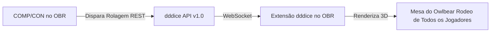

# Plano de Integração: COMP/CON + dddice (Dados 3D no Owlbear Rodeo)

## Status: ✅ Implementado e Revisado

---

## 1. Visão Geral e Arquitetura

O **dddice** é a plataforma padrão de dados 3D compartilhados compatível com o Owlbear Rodeo. Ele funciona através de salas virtuais (`roomSlug`) e uma API REST/WebSocket:

1. A extensão **dddice** fica ativa na sala do Owlbear Rodeo.
2. O jogador ou mestre clica para disparar uma arma, teste de perícia, estrutura, superaquecimento ou dano no **COMP/CON**.
3. O COMP/CON traduz a rolagem para a especificação do dddice e envia para a API (`POST https://dddice.com/api/1.0/roll`).
4. A extensão dddice no Owlbear Rodeo recebe o evento e **arremessa os dados 3D na tela de todos os participantes da mesa**, com som e física realista.

---

## 2. Detecção e Conexão com o dddice

Existem duas formas complementares de vincular a sala:

### A. Detecção Automática via Metadados do Owlbear (Implementado)
Quando a extensão dddice está presente na sala do Owlbear Rodeo, ela armazena identificadores nos metadados da sala (`OBR.room.getMetadata()` / `OBR.scene.getMetadata()`). O `dddiceService` inspeciona:
- Chaves diretas: `com.dddice/room`, `com.dddice.owlbear/room`, `com.dddice/roomSlug`, `com.dddice`, `dddice_room`.
- Qualquer chave ou URL contendo `dddice.com/room/{slug}`.
- O botão **Auto-Detectar** na interface do COMP/CON permite sincronizar a sala em 1 clique.

### B. Autenticação e Configuração de Temas (Revisão Técnica)
- **Modo Guest Gratuito (Automático):** Usuários que não possuem API Key têm um token gerado e armazenado automaticamente via `POST https://dddice.com/api/1.0/user` (com persistência em `localStorage` sob `compcon_dddice_guest_token` para evitar rate limits).
- **Tema Padrão Gratuito:** O tema padrão liberado para usuários convidados/gratuitos no dddice é `dddice-bees`. Se um tema sem permissão for solicitado, o serviço executa fallback transparente para `dddice-bees`.
- **API Key Opcional:** Usuários que possuem conta no dddice com temas exclusivos de Mechs podem inserir sua chave de API para desbloquear seus dados personalizados.
- **Participante / Nome do Ator:** O dddice exibe o Callsign do Piloto, Nome do Mech ou Label do Ator (`external_id`) como autor do arremesso.

---

## 3. Mapeamento de Rolagens do Lancer (COMP/CON)

| Ação no COMP/CON | Dados no dddice | Descrição Visual |
| :--- | :--- | :--- |
| **Ataque Básico / Teste de Habilidade** | `1d20` (+ `1d6` por Acurácia / Dificuldade) | Mostra o d20 e os d6s de Accuracy / Difficulty. |
| **Dano de Armas** | `Nd6`, `Nd3` (mapeado para d6), `Nd4`, `Nd8`, `Nd10`, `Nd12`, etc. | Rola os dados físicos de dano com rótulo descritivo da arma/ação. |
| **Estrutura / Crítico** | `Nd6` com label | Rola os d6s correspondentes ao teste de estrutura na tabela de colapso estrutural. |
| **Superaquecimento (Overheat)** | `1d6` com label | Rola o d6 na tabela de estresse do reator. |
| **Overcharge (Superalimentação)** | `1d6` / Fórmulas de calor | Rola os dados de calor do reator com o nome do Mech. |
| **Checagem de Burn (Queimadura)** | `1d20` (+ acurácia de Engenharia) | Rola teste de engenharia para extinguir o fogo. |
| **Rolagem Genérica (GM Dice Roller)** | Fórmulas arbitrárias | Suporte a qualquer dado rolado pelo menu de dados do mestre. |

---

## 4. Fases de Implementação & Arquivos

### ✅ Fase 1: Serviço `DddiceService` (`src/services/dddiceService.ts`)
- Implementado cliente REST robusto para `https://dddice.com/api/1.0/roll`.
- Gerenciamento de credenciais locais (armazenadas em `localStorage` sob `compcon_dddice_config`).
- Geração automática de tokens guest via `POST /api/1.0/user`.
- Parser resiliente de fórmulas de dados e modificadores (`parseDiceString`).
- Fallback automático para `dddice-bees` caso o tema escolhido não tenha permissão no servidor.
- Botão e método de teste de conectividade (`testRoll`).

### ✅ Fase 2: Integração com os Pontos de Rolagem
- `src/features/active_mode/runner/gm/_components/GmDiceRoller.vue`: Conectado a rolagens personalizadas e quick checks (Hull, Agi, Sys, Eng).
- `src/ui/components/CCDiceMenu.vue`: Conectado a todas as armas, ataques e itens de ficha que utilizam o menu de dados.
- `src/features/active_mode/runner/gm/EncounterPanels/_components/BurnCheckModal.vue`: Conectado a testes de Burn.
- `src/ui/components/CCStructureCheckModal.vue`: Conectado a testes de Estrutura e rolagens de salvamento.
- `src/features/active_mode/runner/gm/EncounterPanels/_components/loadouts/action_buttons/overchargeButton.vue`: Conectado ao cálculo de calor de Overcharge.
- `src/features/active_mode/runner/gm/EncounterPanels/_components/loadouts/action_buttons/_skillCheckBase.vue`: Conectado a testes de perícia HASE do Mech.

### ✅ Fase 3: Interface do Usuário (UI de Configuração)
- `src/ui/components/DddiceConfigPanel.vue`: Painel completo com estética Sci-Fi/Cyberpunk integrado:
  - Toggle global para ativar/desativar dados 3D.
  - Campo de Room Slug com botão "Auto-Detectar" a partir da sala Owlbear.
  - Link direto para abrir a sala no site do dddice.
  - Seleção de temas e carregamento automático de dados da conta.
  - Campo de API Key com toggle de visibilidade de senha.
  - Botão "Testar Rolagem 3D" com feedback visual imediato.
  - Guia rápido de 3 passos para o usuário.
- `src/ui/components/AppOptionsDialog.vue`: Adicionada nova aba **"Dados 3D (dddice)"** nas opções gerais da aplicação.
- `src/ui/components/AppNavbar.vue`:
  - Botão de atalho rápido de dados 3D na barra superior com indicador de status (destacado quando ativo).
  - Item "Dados 3D (dddice)" nos menus dropdown desktop e gaveta mobile.

### ✅ Fase 4: Sincronização OBR + dddice
- `src/services/obrBridge.ts`:
  - Inicialização do `dddiceService` no ciclo `OBR.onReady`.
  - Monitoramento de metadados da sala (`setupRoomMetadataListener`) para detectar alterações de sala do dddice automaticamente.
  - Notificações nativas no OBR via `OBR.notification.show()` ao disparar dados 3D.
  - Gestão de participante (`POST /room/:slug/participant`) para autorização automática e resolução transparente de erros HTTP 403 (Forbidden).
  - Auto-minimização da janela durante rolagens: a janela do COMP/CON recolhe temporariamente para uma barra fina de 48px durante 4 segundos para liberar a visão dos dados 3D rolando no mapa, restaurando-se automaticamente após o lançamento.

---

## 5. Como Usar
1. Instale a extensão oficial **dddice** na loja de extensões do Owlbear Rodeo.
2. Abra a extensão dddice na sua sala do Owlbear Rodeo.
3. No COMP/CON, clique no ícone de dados na barra superior (ou em **Opções > Dados 3D**) e clique em **Auto-Detectar**.
4. Qualquer arma disparada, teste de perícia ou rolagem do mestre agora rolará dados 3D compartilhados na tela de toda a mesa!

